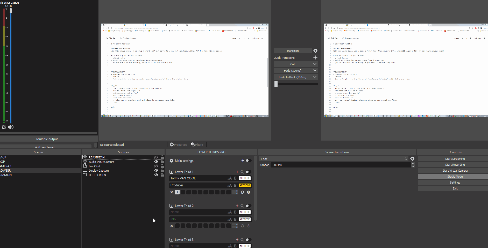

# OBS STUDIO Countdown

**A MUST HAVE SCRIPT**
With this unique timer, you ca setup a *Start Text* that serves to inform what will happen within  "X" days-hours-minutes-seconds

After the elapsed time you can have:
- a Final Text or
- switch to a scene that you can choose froma dropdown menu
- you can even start the recording, if you select it form the drop down.

**INSTALLATION**
- Download this script first
- Open OBS
- Tools > Scripts > + > drag the script *countdownadatpive.lua* inside that window > Open

**USE**
- Into a *Scene* create a *Text field* with **Text (GDI+)**
- Name this text field as you wish
- A window opens: jsut gve "OK"
- Go to *Tools > Scripts*
- Click on Refresh icon
- On *Timer Source* dropdown, check and select the new created text field.
- Close

The text field will have the content of the *countdownadaptive.lua*.

Enjoy

